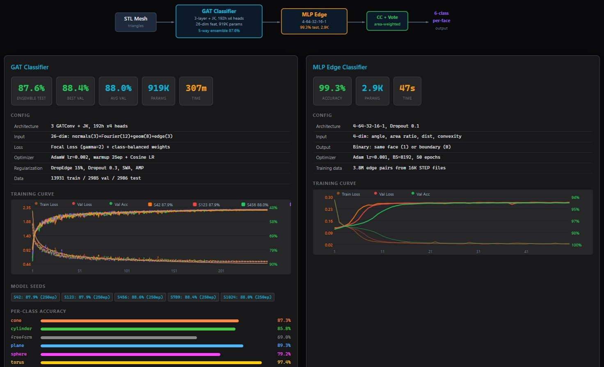

# AiMeshGeoSegmenter

Surface type classification for 3D triangle meshes. Given an STL file, predicts per-face labels: plane, cylinder, sphere, cone, torus, or freeform.



## Architecture

**GAT (Graph Attention Network) directly on mesh triangles.**

```
STL file (triangles)
  |
  | Each triangle = one graph node (26-dim features)
  | Triangle adjacency = graph edges
  |
  v
GAT (3-layer + Jumping Knowledge, 192h x4 heads, 919K params)
  |
  v
Per-triangle 6-class prediction
  |
  v
MLP Edge Classifier (4→64→32→16→1, 3-model ensemble)
  |
  v
Connected Components + Area-Weighted Vote
  |
  v
Per-face final label: plane / cylinder / sphere / cone / torus / freeform
```

## Output Classes

| # | Class | Detection |
|---|-------|-----------|
| 1 | Plane | GeomAbs_Plane |
| 2 | Cylinder | GeomAbs_Cylinder |
| 3 | Sphere | GeomAbs_Sphere + least-squares recovery |
| 4 | Cone | GeomAbs_Cone |
| 5 | Torus | GeomAbs_Torus |
| 6 | Freeform | BSpline, Bezier, Revolution, Extrusion |

## Quick Start

```bash
pip install -r requirements.txt
python infer_standalone.py input.stl
```

Outputs JSON with per-face classification, vertex data, and colors.

## Results

| Version | Samples | Architecture | Test Acc |
|---------|---------|-------------|----------|
| v1 | 2K | 10-dim baseline | 63.25% |
| v2 | 2K | 14-dim + Focal Loss | 71.23% |
| v3 | 2K | 26-dim + JK + AMP + DropEdge + SWA | 83.04% |
| v4 | 20K | 3-seed ensemble | 87.88% |
| v5 | 20K | 5-seed ensemble, no CV | **87.60%** |

Per-class accuracy (v5, 2,986 test parts):
- Torus 97.43%, Plane 89.26%, Cone 87.27%, Cylinder 85.75%, Sphere 79.23%, Freeform 68.95%

Single model val acc: S42=87.88%, S123=87.94%, S456=88.02%, S789=88.36%, S1024=88.03%

## Model Details

| Component | Detail |
|-----------|--------|
| GAT | 3-layer + Jumping Knowledge, 192h x4 heads, 919K params |
| GAT Input | 26-dim: normals(3) + Fourier position(12) + geometry(8) + edge(3) |
| Edge MLP | 4→64→32→16→1, 2.9K params, 3-model ensemble |
| MLP Input | 4-dim: dihedral angle, area ratio, distance, convexity |
| MLP Accuracy | 99.3% |
| Training | AMP + Focal Loss(γ=2) + DropEdge 15% + SWA + Cosine LR |
| Data | 19,902 parts, 13,931 train / 2,985 val / 2,986 test |

## Pipeline

```
STL mesh
  │
  ├─ GAT (26-dim + JK + AMP + DropEdge)
  │     └→ per-triangle 6-class prediction
  │
  ├─ MLP Edge Classifier (4-dim, 99.3%)
  │     └→ detect face boundaries
  │
  ├─ Connected Components
  │     └→ group triangles into regions
  │
  └─ Area-Weighted Majority Vote
        └→ per-face final label
```

## Project Structure

```
AiMeshGeoSegmenter/
├── data/
│   ├── step/       20K STEP source files
│   ├── stl/        20K STL files
│   └── labels/     20K per-face label JSONs
├── scripts/
│   ├── label_faces.py       STEP → face type labels
│   ├── step_to_stl.py       STEP → STL conversion
│   ├── build_data.py        Labels + STL → training graphs
│   ├── train_5ensemble.py   5-model ensemble training
│   ├── train_edge.py        MLP edge classifier training
│   └── infer.py             Inference pipeline
├── models/                  Model weights + training logs
├── release/                 Standalone inference package
├── viewer/                  Web viewer (localhost:8006)
└── README.md
```

## Limitations

- **Sphere label quality**: OCCT GeomAbs_Sphere only. Freeform→sphere recovery requires ≥100 vertices + subdivision + <0.5% RMS error.
- **Rotation sensitivity**: Fourier position encoding is not rotation-invariant.
- **Mesh resolution**: Low-vertex faces (<100 vertices) cannot reliably fit geometric primitives.
- **Freeform accuracy**: 68.95% — the hardest class due to surface variety.

## Future Work

- [ ] Cylinder/Cone/Torus recovery from freeform faces (RANSAC fitting)
- [ ] Rotation-invariant features
- [ ] Test-time augmentation
- [ ] STL→STEP reverse engineering pipeline (numerical fitting + B-Rep construction)

## License

MIT
